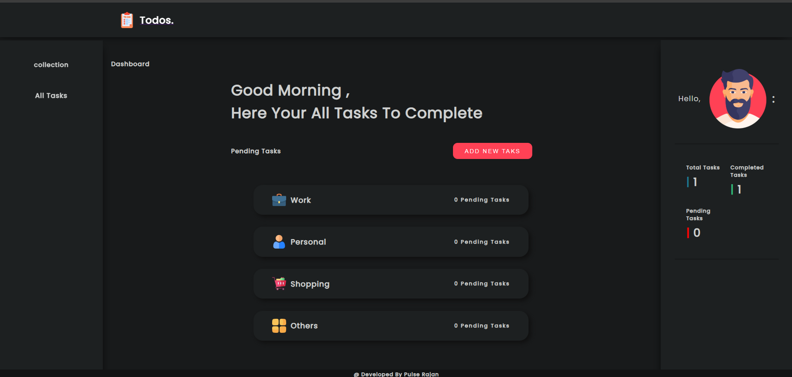
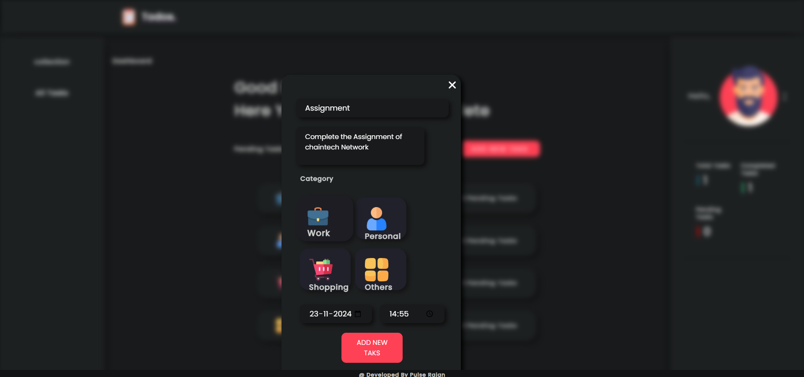
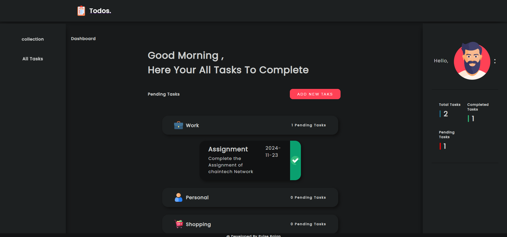

# MyTodo App

Welcome to **MyTodo**, a simple and efficient application to manage your tasks. With features like categorizing todos, setting deadlines, and adding new tasks, MyTodo ensures you stay productive and organized.

---

## Features

- **Add Todos**: Create todos with ease and keep track of all your tasks.
- **Categorization**: Organize tasks into categories for better visibility and management.
- **Deadline Setting**: Add deadlines to your tasks and never miss an important date.

---

## Built With

- **Node.js**: Backend development.
- **Express.js**: Framework for building web applications.
- **MongoDB**: Database for storing tasks and categories.

---

## Screenshots

### Dashboard


### Add Todo


### Categorized Todos


### Deadlines


---

## Getting Started

Follow these steps to get the MyTodo app running on your system.

### Prerequisites

- [Node.js](https://nodejs.org/) installed
- [MongoDB](https://www.mongodb.com/) installed and running

### Installation

1. **Clone the repository**
   ```bash
   git clone https://github.com/your-username/MyTodo.git
   cd MyTodo
   ```

2. **Install dependencies**
   ```bash
   npm install
   ```

3. **Set up environment variables**

   Create a `.env` file in the root directory and add the following:
   ```env
   MONGO_URI=mongodb://localhost:27017/mytodo
   PORT=3000
   ```

4. **Start the server**
   ```bash
   npm start
   ```

5. **Access the application**
   Open your browser and navigate to `http://localhost:3000`.

---

## Contributing

Contributions are welcome! Please follow these steps:

1. Fork the repository.
2. Create a new branch (`git checkout -b feature-name`).
3. Commit your changes (`git commit -m "Add a feature"`).
4. Push to the branch (`git push origin feature-name`).
5. Create a pull request.

---

## Author

- **Pulse Rajan**  
  - [LinkedIn](https://www.linkedin.com/in/pulserajan/)  
  - [Portfolio](https://pulserajan.rf.gd)

Feel free to reach out for feedback, collaborations, or just to say hi! 😊

---

## Acknowledgements

- [Awesome Readme Templates](https://awesomeopensource.com/project/elangosundar/awesome-README-templates)
- [Awesome README](https://github.com/matiassingers/awesome-readme)

---

## License

This project is licensed under the [MIT License](LICENSE).

---

Thank you for checking out **MyTodo**! 🚀
